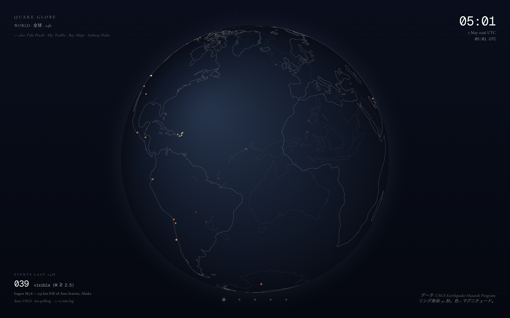
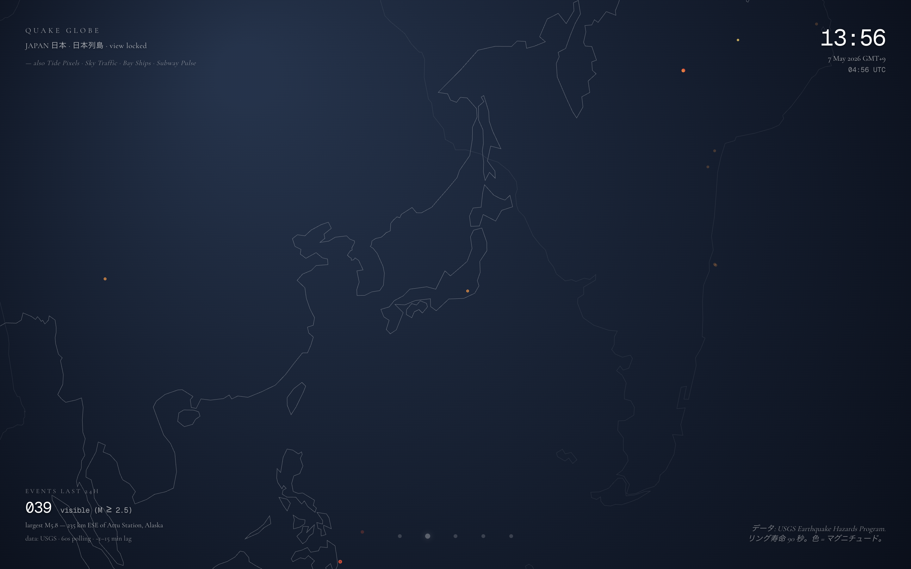
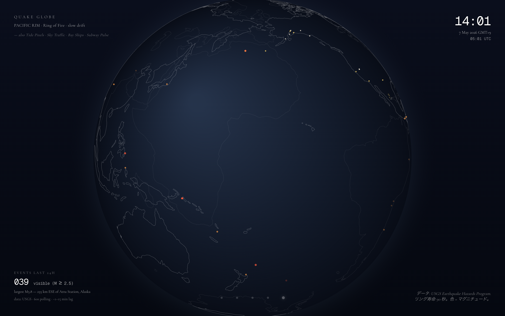

# Quake Globe

Live global earthquakes from the USGS Earthquake Hazards Program, rendered as ringing light pulses on a slowly spinning interactive globe. Built as a real-time Mac desktop wallpaper. Sister piece to [Tide Pixels](https://github.com/Jada-Q/tide-pixels), [Sky Traffic](https://github.com/Jada-Q/sky-traffic), [Bay Ships](https://github.com/Jada-Q/bay-ships), [Subway Pulse](https://github.com/Jada-Q/subway-pulse).

<p align="center">
  
  
  
</p>

<p align="center"><em>Same minute, three views of the same spinning globe — World · Japan · Pacific Rim. Each ring is a real quake from the last 24 hours.</em></p>

**Live**: [quake-globe-2026-05-07.vercel.app](https://quake-globe-2026-05-07.vercel.app)

Open it in a browser tab, or set it as a Mac desktop wallpaper via [Plash](https://sindresorhus.com/plash) and watch the planet's seismic pulse.

---

## Five regions

| Region | URL |
|---|---|
| World (default) | [`/`](https://quake-globe-2026-05-07.vercel.app/) |
| Japan 日本 | [`/?r=japan`](https://quake-globe-2026-05-07.vercel.app/?r=japan) |
| Americas | [`/?r=americas`](https://quake-globe-2026-05-07.vercel.app/?r=americas) |
| Europe | [`/?r=europe`](https://quake-globe-2026-05-07.vercel.app/?r=europe) |
| Pacific Rim | [`/?r=pacific-rim`](https://quake-globe-2026-05-07.vercel.app/?r=pacific-rim) |

**Magnitude floor**: `/?min=4` — only show M ≥ 4 (default `min=2.5`; USGS publishes a lot of M<3 noise).

The bottom dot row (right side on mobile) lets you switch regions live. In v2 a region is a *camera*, not a filter — every quake on Earth is always rendered; the region preset just picks the rotation, zoom, and whether to keep auto-rotating.

---

## Interaction

- **Drag** the globe with the mouse (or finger on mobile) to spin it freely
- **Scroll wheel / pinch** to zoom from 0.5× to 5× the base radius
- **Auto-rotation** runs at ~6°/second on the `world` and `pacific-rim` presets — leave it alone and the planet drifts west on its own. After 3 seconds of no interaction, drag input is released and auto-rotation resumes (unless the active preset locks the view)
- **`japan` / `americas` / `europe` presets lock the view** — the globe stops spinning so you can read the region

A Mac Plash viewer with `Browsing Mode` off sees the auto-rotating planet without needing to click anything.

---

## What's actually drawn

- **Sphere** — a radial-gradient disk that gives the globe a faint terminator (top-left lit, bottom-right shadowed). Plus a 1-pixel outer halo to suggest atmosphere.
- **Coastlines** — `world-atlas/land-110m` TopoJSON, rendered with d3-geo. The front hemisphere strokes at 32% white alpha; the back hemisphere strokes at 12% so continents on the far side ghost through. Low-res on purpose: too much detail aliases into noise at wallpaper size.
- **Static dot** — every quake's epicenter persists for the full 24 h window. Front hemisphere dots at 55% alpha, back hemisphere dots at 18%. Location stays markable after the ring fades.
- **Expanding ring** — when the canvas first sees a quake, it animates an outward ring for 90 s. Radius scales with magnitude (`6 + mag * 14` px → M3 ≈ 48 px, M6 ≈ 90 px). Front-hemisphere rings fade 0.85 → 0; back-hemisphere rings fade 0.21 → 0 (so back-side quakes still register without overpowering the front).
- **Color by magnitude** —
  - M < 3 → warm white `#f0e8d4`
  - M 3–4 → yellow `#ffd86a`
  - M 4–5 → orange `#ff9f4a`
  - M 5–6 → red-orange `#ff5a3a`
  - M ≥ 6 → deep red `#d62a3a` with stronger glow halo
- **Recent / strong glow** — quakes < 60 s old or M ≥ 6 get an additional radial gradient halo (front-hemisphere only — the front side is where you read magnitude).

The art-piece label at the bottom-right says it: *"データ: USGS Earthquake Hazards Program. リング寿命 90 秒。色 = マグニチュード。"*

Projection is **orthographic** (d3.geoOrthographic on Canvas 2D) — a real sphere, not Mercator or equirectangular. We deliberately *don't* clip the back hemisphere; instead, far-side features render at low alpha so the globe reads as see-through ambient art. No Three.js, no WebGL — the whole render path is a few hundred lines of d3-geo + Canvas 2D.

---

## Data

- **Source**: [USGS Earthquakes Feed](https://earthquake.usgs.gov/earthquakes/feed/) — `summary/all_day.geojson` (last 24 h, ~200–400 events globally at any moment)
- **Lag**: USGS auto-publishes events ~1–15 minutes after detection for small quakes; large events are typically faster
- **Polling**: client polls our API proxy every 60 s; proxy caches USGS for 50 s

The feed URL is documented in `app/api/quakes/route.ts` so you can swap it for `all_hour`, `all_week`, or `all_month`.

---

## Tech stack

- Next.js 16 (App Router, server components for `searchParams`)
- Tailwind v4
- Cormorant Garamond + Geist Mono (`next/font/google`)
- [`d3-geo`](https://github.com/d3/d3-geo) — orthographic projection + spherical math
- [`world-atlas`](https://github.com/topojson/world-atlas) + [`topojson-client`](https://github.com/topojson/topojson-client) — coastlines
- Plain Canvas 2D + RAF — no Three.js, no WebGL, no animation library

---

## Local dev

```bash
pnpm install
pnpm dev
```

Open <http://localhost:3000>.

```bash
pnpm build  # production build
```

---

## Used as a desktop wallpaper

1. Install [Plash](https://apps.apple.com/app/plash/id1494023538) (free, Mac App Store).
2. Plash menu bar → `Add Website…` → paste a region URL above.
3. Keep `Browsing Mode` off — the `world` and `pacific-rim` URLs auto-rotate (~6°/s, 60s per revolution), so you get motion without ever touching the desktop. Locked-view URLs (`japan`, `americas`, `europe`) sit still and are calmer for a focus monitor.

For multi-display: Pacific Rim on one monitor, Americas on another. The asynchrony of the planet's seismic activity makes the screens feel alive without ever being distracting.

---

## Elsewhere

- [Tide Pixels](https://github.com/Jada-Q/tide-pixels) — moon-driven tide and sky over your city
- [Sky Traffic](https://github.com/Jada-Q/sky-traffic) — live aircraft trails over your city's airspace
- [Bay Ships](https://github.com/Jada-Q/bay-ships) — ship lanes through major harbors
- [Subway Pulse](https://github.com/Jada-Q/subway-pulse) — Tokyo metro lines as a Beck-style abstract diagram

---

## License

MIT — do whatever you want, but if you ship a paid product literally cloned from this, at least drop a thank-you somewhere.
